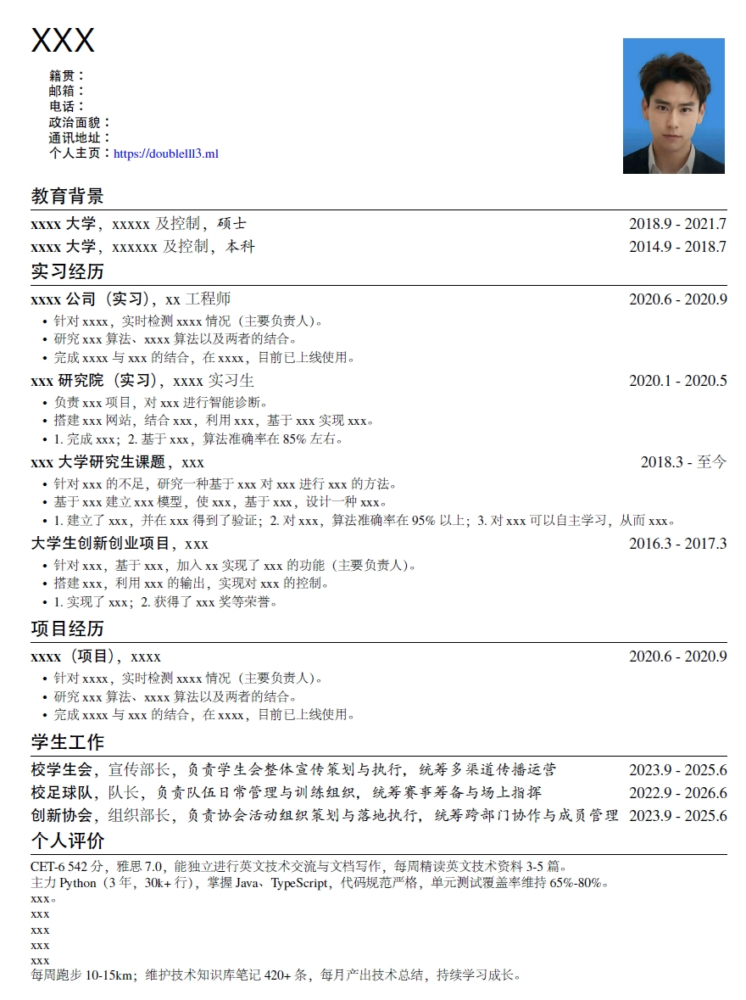
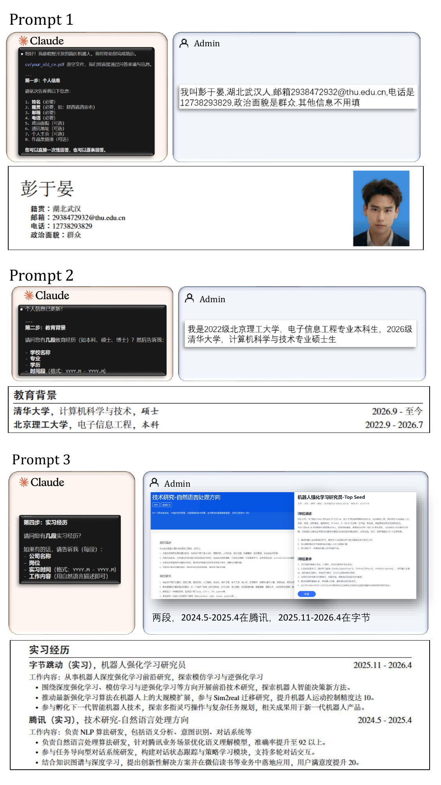
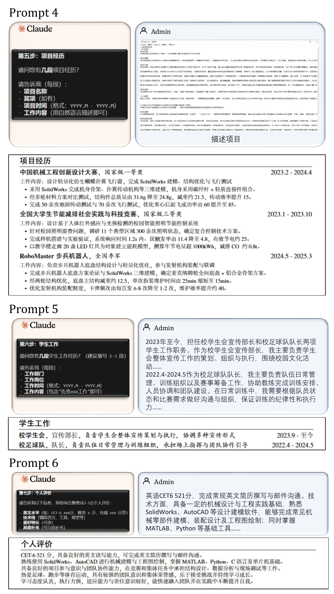
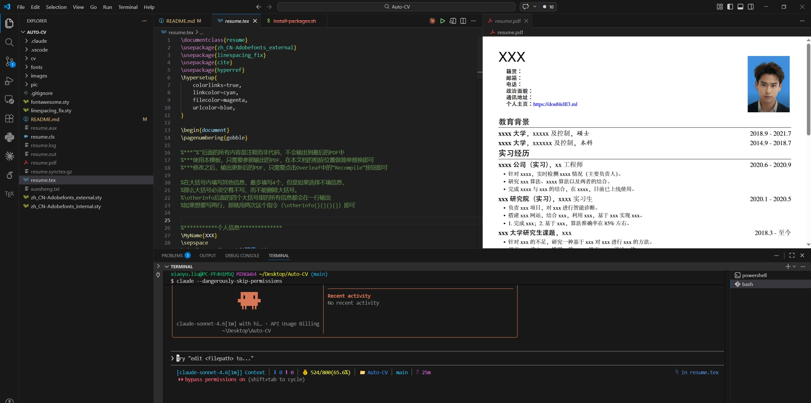

# Auto - CV ：自然语言描述的简历助手

一个基于 LaTeX 的中文简历模板，配合 Claude Code 的 `/Auto-CV` 对话式技能，实现**自然语言描述、生成简历 PDF**。

**Auto - CV 可以做什么？**

1. 导入简历，自动提取内容并转换
---


> 本模板参考自 [Overleaf 中文简历模板](https://www.overleaf.com/latex/templates/zhong-wen-jian-li-mo-ban-chinese-resume-template/jgdzmymxmpfc)
---

2. 交互式自然语言描述制作简历




---

## 目录结构

```
Auto-CV/
├── resume.tex              # 简历主文件（编辑此文件）
├── resume.cls              # 自定义文档类（排版逻辑）
├── images/
│   └── you.jpg             # 简历照片（替换为本人照片）
├── fonts/                  # 内嵌字体（XeLaTeX 使用）
├── fontawesome.sty         # 图标支持
├── linespacing_fix.sty     # 行距修正
├── zh_CN-Adobefonts_*.sty  # 中文字体配置
└── .claude/
    └── skills/Auto-CV/
        ├── skill.md        # /Auto-CV 技能定义
        └── shell/
            ├── build.sh            # 本地一键编译脚本
            └── install-packages.sh # 首次使用宏包安装脚本
```

---

## Quick Start in 3 minutes 三分钟快速开始

### 第 0 步：安装依赖（首次使用）

**1. 安装 MiKTeX（LaTeX 编译环境）**

```bash
winget install --id MiKTeX.MiKTeX -e --accept-source-agreements --accept-package-agreements
```

安装完成后**重启终端**，再运行以下命令预装所有宏包：

```bash
bash .claude/skills/Auto-CV/shell/install-packages.sh
```

**2. 安装 VS Code 插件**

在 VS Code 扩展面板搜索并安装以下两个插件：

| 插件 | 作者 | 说明 |
|------|------|------|
| **LaTeX** | Mathematic Inc | LaTeX 语言支持 |
| **LaTeX Workshop** | James Yu | 实时预览、编译、语法高亮 |

---

### 第 1 步：克隆项目

```
git clone https://github.com/flamingoTOM/Auto-CV.git
```

### 第 2 步：使用 `/Auto-CV` 技能

在 [Claude Code](https://github.com/anthropics/claude-code) 项目目录下运行：

```
/Auto-CV
```

技能将分 **7 个步骤**引导填写简历：


每步填写完毕后自动更新 `resume.tex`，全部完成后可直接编译输出 PDF。

> 也可将原始信息写入 `.txt` 文件，通过 `/Auto-CV 参考 xxx.txt` 的方式批量导入。


### 第 3 步：查看 PDF

编译完成后，用 LaTeX Workshop 的预览功能或直接打开 `resume.pdf` 查看效果。



---


## License

MIT
